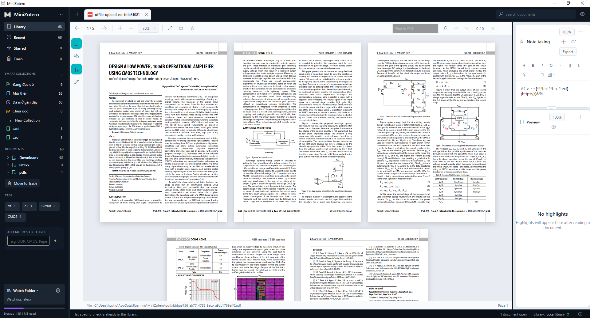

# MiniZotero

MiniZotero is a desktop reference manager for reading PDF documents, organizing a small research library, and keeping notes close to the source material.

The app is built with C#, .NET 8, Avalonia UI, and an MVVM structure. It is designed as a simple student-friendly desktop project rather than a large enterprise system.

## Features

- Import and manage PDF documents.
- Organize documents with collections, tags, starred items, and trash.
- Read PDFs in the built-in workspace.
- Highlight text and keep document notes in the side panel.
- Search library items from the main window.
- Store app data locally.

## Tech stack

- C#
- .NET 8
- Avalonia UI
- CommunityToolkit.Mvvm
- PDF.js assets for PDF rendering

## Project structure

```text
MiniZotero/
  Assets/
  Converters/
  Helpers/
  Models/
  Repositories/
  Services/
  ViewModels/
  Views/
```

The project follows a simple MVVM flow:

```text
View -> ViewModel -> Service -> Repository / local storage / PDF assets
```

Views define the Avalonia UI layout. ViewModels expose state and commands for binding. Services contain the main application logic. Repositories handle local persistence.

## Run the app

Requirements:

- .NET 8 SDK or newer

Run from the repository root:

```powershell
dotnet run --project .\MiniZotero\MiniZotero.csproj
```

Build the app:

```powershell
dotnet build .\MiniZotero\MiniZotero.csproj
```

## App preview



## Logo and credit


Credit: Le Huu Hoang

## License

This project is licensed under the MIT License.
